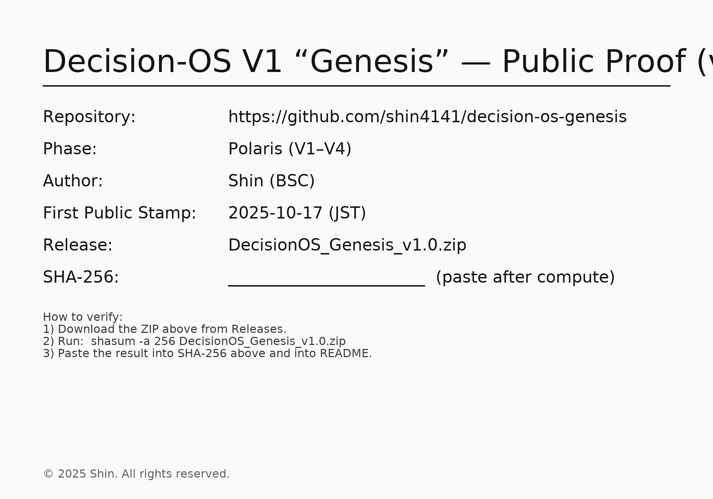

Sales / Support (JP/EN)
公開名：Decision-OS Lab
提供形式：Notion閲覧権限付与（PDFなし）
通常価格：¥50,000 ／ 72h 早割：¥40,000
購入フロー：決済 → 購入時メールへNotion権限付与（24h以内）
返金ポリシー：デジタル特性上、原則返金不可（重複決済・明確な不備は個別対応）
サポート：support+decisionv4@yourmail.com
 ／ または GitHub Discussions

購入リンク：

通常：準備中（リンク差し替え予定）

72h早割：準備中（リンク差し替え予定）

詳細（Notion）：購入後にご案内

# Decision-OS V1 “Genesis” (Polaris Phase)

> **Polaris — Fix the axis of decision.**  
> *The unshakable reference star of Decision-OS V1–V4.*

**First Public Stamp**: 2025-10-17 (JST)  
**Repo**: https://github.com/shin4141/decision-os-genesis  
**Author**: Shin (BSC)

---

## What is this? (EN)
Decision-OS turns hesitation into procedures and ends decisions with profit checks.  
This repository is the **Genesis** stamp—an immutable public record of the V1 core.

- **Public = Proof**: structure, roadmap, changelog  
- **Subscribers = Value**: procedures, thresholds, templates

## Files (Release ZIP)
- `DecisionOS_Genesis_v1.0_JA.pdf` — Main + guide (single PDF)
- `VERSION.txt` — `v1.0.0-genesis` / JST timestamp
- `HASH.txt` — SHA-256 of the release ZIP
- `LICENSE.txt` — All Rights Reserved (initial)
- `CREDITS.txt` — Author: Shin / BSC

## Integrity
Release: `DecisionOS_Genesis_v1.0.zip`  
SHA-256: `<< 88ade1bb9a7225def1304757cd253305ed71f3de7b8d2a25c81ec9e15b4db8e5
 >>`

**Verify**
```bash
shasum -a 256 DecisionOS_Genesis_v1.0.zip

## Public Proof (PNG)

